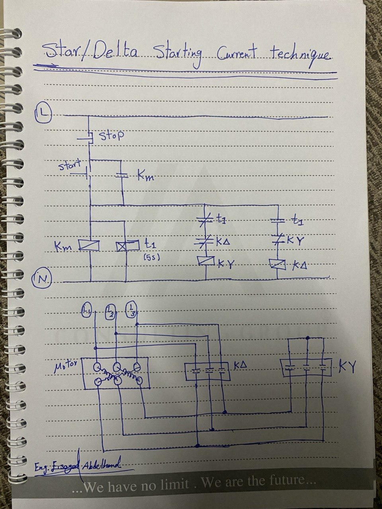

# Star-Delta-Motor-Starter-Reduced-Starting-Current

## 📌 Project Overview

This project demonstrates a **Star-Delta motor starter** using **classic control (relay logic)** to reduce the high starting current of an induction motor.

The system automatically switches from **Star (Y)** to **Delta (Δ)** after a time delay.

---

## ⚙️ Objective

To:

* Reduce starting current
* Protect the motor from electrical stress
* Ensure smooth startup

---

## 🔧 Components Used

* Main Contactor (KM)
* Star Contactor (KY)
* Delta Contactor (KΔ)
* Timer Relay (t1 - 5 seconds)
* Start Push Button (NO)
* Stop Push Button (NC)
* 3-Phase Induction Motor

---

## ⚡ Working Principle

### 1. Start Mode (Star Connection)

* Press **Start**
* KM and KY are energized
* Motor starts in **Star mode**
* Voltage per phase is reduced → lower current

---

### 2. Transition Phase

* Timer (t1) starts counting (5 seconds)
* KY is de-energized after time delay

---

### 3. Run Mode (Delta Connection)

* KΔ is energized
* Motor runs in **Delta mode**
* Full voltage applied → normal operation

---

## 🔐 Safety Interlocking

* KY and KΔ must **NEVER be ON at the same time**
* Electrical interlocking is used:

  * KY NC contact in Delta circuit
  * KΔ NC contact in Star circuit

---

## ⚠️ Important Notes

* Wrong interlocking may cause **short circuit**
* Timer must ensure delay between switching
* Suitable for motors designed for Star-Delta starting

---

## 📷 Control & Power Diagram

---

## 🎥 Demo Video

---

## 🚀 How to Operate

1. Power ON the system
2. Press Start → Motor starts in Star
3. Wait 5 seconds → automatically switches to Delta
4. Press Stop → system stops immediately

---

## 🧠 Key Concepts

* Reduced starting current
* Star/Delta transformation
* Timer ON delay
* Electrical interlocking
* Industrial motor control
